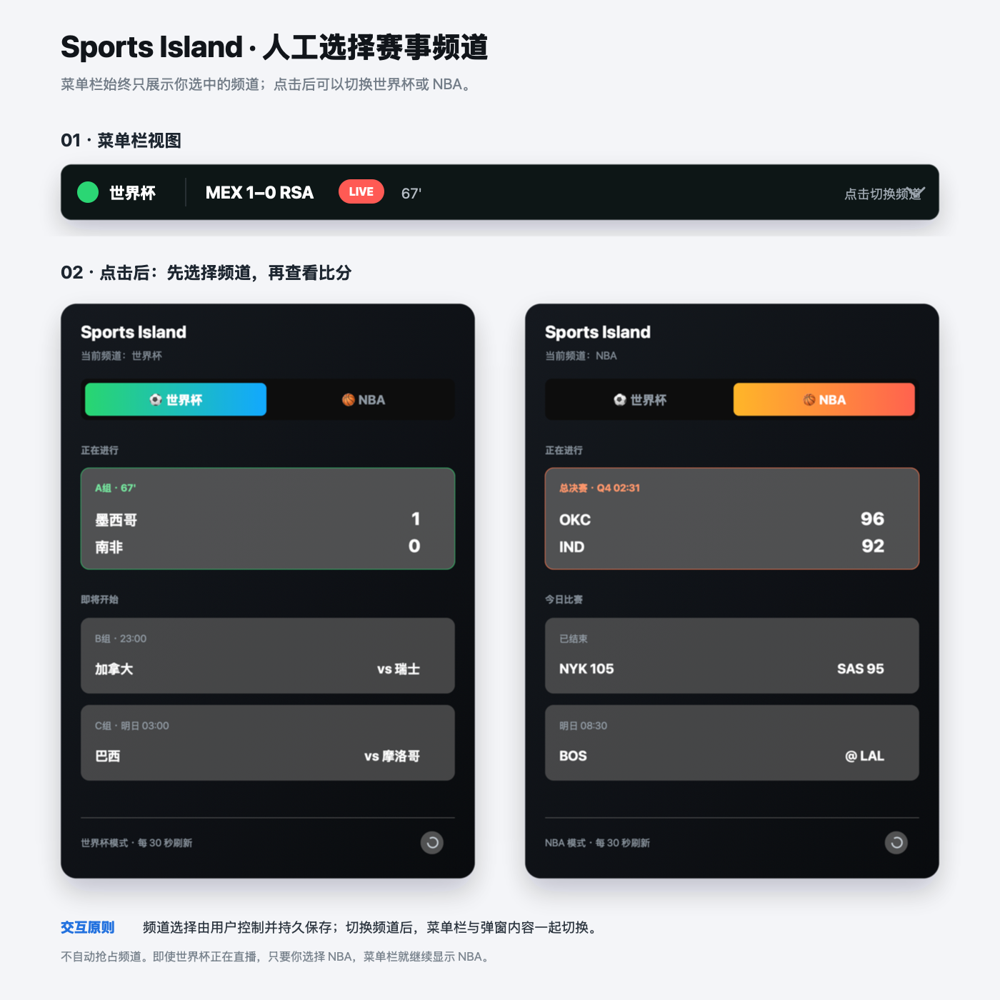

# Sports Island

一个运行在 macOS 菜单栏中的轻量体育比分插件。支持人工切换
**2026 世界杯**与 **NBA** 频道，并记住上次选择。

下图为频道切换与菜单结构的交互概念图：



## 功能

- 世界杯与 NBA 频道手动切换
- 世界杯国家队中文名称
- 顶栏固定宽度，内容变化时其他菜单栏图标不会移动
- 长消息在固定窗口内滚动
- 世界杯实时比分、比赛分钟和未来两天赛程
- 世界杯进球球员、红黄牌与补时时间轮播
- 使用 `+1`、`+2` 表示明天、后天的比赛
- 世界杯相关小组积分榜与出线前景
- NBA 实时比分与比赛状态
- 比分数据每 30 秒更新，滚动动画每秒刷新
- 不需要 API Key

## 顶栏示例

```text
巴西4–0俄罗斯·67'
7'·瑞典 Yasin Ayari破门
86'·土耳其 Yunus Akgün黄牌
下半场补时6分钟
西班牙vs佛得角·+1 00:00
```

插件不会轮播“某队迎战某队”一类无价值填充内容。
进球、红牌、黄牌和补时时间会优先轮播；没有关键事件时，
只有本地规则能够判断出有意义的比赛变化，才会插入一句短提示。
最新进球与红牌会在整场比赛中保留，黄牌只短暂提醒；全部关键事件
可以在下拉菜单中查看。

## 安装

1. 安装 [SwiftBar](https://swiftbar.app/)。
2. 下载本仓库。
3. 在 SwiftBar 中将插件目录设置为仓库中的 `plugins` 文件夹。
4. 确保插件可以执行：

```bash
chmod +x plugins/sports-score.1s.py
```

SwiftBar 会自动加载 `sports-score.1s.py`。

## 使用

点击菜单栏比分，在下拉菜单底部选择频道：

```text
选择频道
  世界杯
  NBA
```

选择结果保存在：

```text
~/Library/Application Support/SportsIsland/channel
```

## 显示规则

世界杯顶栏优先显示正在进行的比赛，其次显示即将开始的比赛。

```text
比赛中：韩国0–0捷克·45'
今天：  瑞典vs突尼斯·10:00
明天：  西班牙vs佛得角·+1 00:00
后天：  法国vs塞内加尔·+2 03:00
```

比赛开始或结束后不再显示 `+N` 日期标记。

## 数据源

- NBA 官方公开比分 JSON
- ESPN 世界杯 scoreboard、summary 与 standings 数据

当前插件只请求比分、赛程、关键事件和积分榜，不保存账户信息。

公开接口可能调整字段或限制访问。如果用于正式发布或商业用途，建议改用正式授权的体育数据服务。

## 开发

直接运行插件查看 SwiftBar 输出：

```bash
plugins/sports-score.1s.py
```

切换频道：

```bash
plugins/sports-score.1s.py --set-channel worldcup
plugins/sports-score.1s.py --set-channel nba
```

## License

[MIT](LICENSE)
